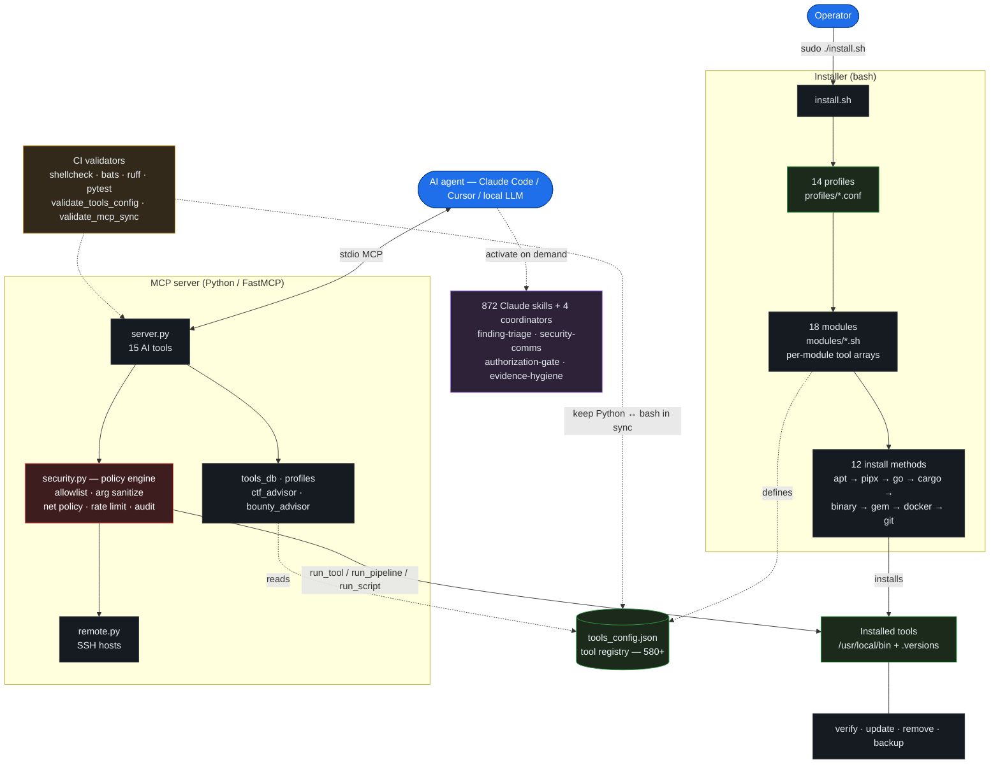

[](https://github.com/26zl/cybersec-toolkit/actions/workflows/ci.yml)
[](https://github.com/26zl/cybersec-toolkit/actions/workflows/integration.yml)
[](https://github.com/26zl/cybersec-toolkit/actions/workflows/security.yml)
[](https://github.com/26zl/cybersec-toolkit/actions/workflows/uv-update.yml)


```text
   ______      __              _____
  / ____/_  __/ /_  ___  _____/ ___/___  _____
 / /   / / / / __ \/ _ \/ ___/\__ \/ _ \/ ___/
/ /___/ /_/ / /_/ /  __/ /   ___/ /  __/ /__
\____/\__, /_.___/\___/_/   /____/\___/\___/
     /____/                          by 26zl
              Toolkit
```

__Cybersecurity toolkit with built-in AI integration.__ An embedded [MCP (Model Context Protocol)](https://modelcontextprotocol.io/) server lets any MCP-capable AI -- Claude Code, Claude Desktop, Cursor -- query the tool registry, check install status, recommend the right tools for a CTF category or bug-bounty target, and execute them with enforced safety policies (argument sanitization, network allowlists, rate limiting, audit logging). Jump to [MCP Server (AI Integration)](#mcp-server-ai-integration).

Bundled with a modular installer for Linux and Termux (Android) covering __580+ tools__, __18 modules__, __14 profiles__, and __12 install methods__.

> __What makes it different:__ most toolkits stop at _installing_ tools. Here an AI can also _drive_ them — infer the problem type, pick the right tools from all modules/profiles, and work with you as an interactive companion. When you explicitly authorize it, the same MCP toolchain can enter an autonomous solver loop. __Companion by default; autonomous only when you ask.__

---

## How it works

Two entry points share one tool registry. An __operator__ runs the bash installer to put tools on disk; an __AI agent__ talks to the MCP server to discover, recommend, and safely execute those same tools. `tools_config.json` is the single source of truth the modules define and the MCP advisors read, and CI validators keep the Python and bash sides in sync.

<!-- Rendered to a PNG so it shows everywhere — including the GitHub mobile app,
     which displays raw Mermaid instead of rendering it. Edit the Mermaid source in
     the <details> block below, then re-render with:
     npx @mermaid-js/mermaid-cli -i diagram.mmd -o assets/how-it-works.png -t dark -b "#0d1117" -s 3 -->


<details>
<summary>Diagram source (Mermaid)</summary>



</details>

__Reading the diagram:__ solid arrows are runtime/install actions, dashed arrows are data relationships. The installer (left) and MCP server (right) never call each other — they meet at the registry and at the tools on disk. `security.py` is the gate every AI-driven execution passes through; nothing reaches the shell without clearing the allowlist, argument sanitization, and network policy. Skills are methodology context the AI loads on demand; they guide _how_ tools get used but sit outside the execution path.

---

## Why not just Kali (or another installer)?

Kali/Parrot/BlackArch ship the tools; this is __complementary, not a replacement__. It runs on the box you already have (incl. Termux) and adds what a distro doesn't: an __AI control plane__ that can discover, recommend, chain, and safely _execute_ those tools under one policy. Want all the tools? A distro is fine. Want an AI that can _use_ them safely? That's the gap.

## Trust & safety

Security users should be paranoid — here's exactly what runs and what's gated:

- __Default-safe MCP.__ Out of the box `CYBERSEC_MCP_ALLOW_EXTERNAL=0` (network tools can only hit private/loopback ranges) and `CYBERSEC_MCP_ALLOW_SCRIPTS=0` (`run_script` disabled). You opt into external scopes / scripting explicitly.
- __Every AI execution passes one gate__ (`mcp_server/security.py`): registry allowlist, no shell (`create_subprocess_exec`, never `shell=True`), argument sanitization, a per-tool blocked-flag denylist (e.g. `sqlmap --os-shell`, `nmap -iL`, file-list/target-injection flags), target/network policy, rate limiting, output caps, and timeouts.
- __Tool-aware policy is not solver hardcoding.__ The solver chooses tools from the registry/advisors; the policy layer only understands enough CLI grammar to tell a real target from a header, wordlist, output path, config file, or target-list flag. That keeps normal commands usable without letting file-list/config flags bypass scope checks.
- __Audit trail, not leaks.__ Actions are logged as JSON to an owner-only (`0600`) rotating `audit.log`. Script bodies are never persisted — only an irreversible SHA256 + length is logged for correlation — and credential-shaped strings are redacted from tool arguments.
- __Least privilege in the installer.__ It runs as root but drops to the invoking user (`$SUDO_USER`) for cloned-repo builds and `pip`/`cargo`/`gem` installs; binary releases are SHA256-verified when checksums are published.
- __Dual-use tooling is gated.__ C2 and phishing frameworks (Sliver, Caldera, gophish, evilginx, …) are __off by default__ and install only with `--include-c2` (the `redteam`/`full` profiles); the MCP layer reflects this and never auto-runs them.
- __Authorized use only.__ See [`SECURITY.md`](SECURITY.md), the [Supply Chain Model](#supply-chain-model), and the [Disclaimer](#disclaimer).

---

## Install

All required runtimes (Python, Go, Ruby, Java, Rust, Node.js), dev libraries, pipx, and build tools are installed automatically. The only prerequisite is a supported Linux distro. Windows and macOS are not supported (use WSL or Docker).

> __Docker__ is the one exception — install it manually if you want C2 frameworks, MobSF, BeEF, BloodHound, TheHive, or Cortex (`--enable-docker`). See [Docker install docs](https://docs.docker.com/engine/install/).
> __GitHub authentication__ is recommended. The installer downloads ~30 binary releases and makes ~30+ API calls to GitHub. Without auth, you're limited to __60 requests/hour__ and some downloads may fail. With auth, the limit is __5,000/hour__. The easiest way:
>
> ```bash
> # Install gh CLI and log in (one-time) — the installer auto-detects it
> sudo apt install gh && gh auth login
> ```
>
> Alternatively, export a [personal access token](https://github.com/settings/tokens) (no scopes needed):
>
> ```bash
> export GITHUB_TOKEN=ghp_xxxxxxxxxxxxxxxxxxxx
> ```

```bash
git clone https://github.com/26zl/cybersec-toolkit.git && cd cybersec-toolkit && sudo ./install.sh
```

That installs all 580+ tools. To install a subset:

```bash
sudo ./install.sh --profile ctf                      # CTF tools only
sudo ./install.sh --profile redteam --enable-docker   # Red team + Docker C2
sudo ./install.sh --module web --module recon          # Specific modules
sudo ./install.sh --tool sqlmap --tool nmap            # Individual tools
sudo ./install.sh --dry-run --profile ctf              # Preview without installing
```

### Try in Docker

```bash
docker build -t cybersec-toolkit .
docker run cybersec-toolkit --profile ctf
```

> __Podman__ works as a drop-in replacement — swap `docker` for `podman` (or `alias docker=podman`); rootless builds and runs are supported. For the Compose example below, use `podman compose` (needs a compose provider installed).

Or use the bundled Compose file (builds and runs the `installer` service):

```bash
docker compose run installer --profile ctf
```

__macOS (Apple Silicon):__ Add `--platform linux/amd64` to both commands to run via x86 emulation:

```bash
docker build --platform linux/amd64 -t cybersec-toolkit .
docker run --platform linux/amd64 cybersec-toolkit --profile ctf
```

__Termux (Android, experimental):__

> __Note:__ Termux support is under development and has not been fully tested on physical Android devices. Expect rough edges.

```bash
pkg install git
git clone https://github.com/26zl/cybersec-toolkit.git
cd cybersec-toolkit
./install.sh --profile lightweight
```

<details>
<summary><strong>All flags</strong></summary>

```bash
sudo ./install.sh --help                # Full help
sudo ./install.sh --list-profiles       # Show profiles
sudo ./install.sh --list-modules        # Show modules
sudo ./install.sh --skip-heavy          # Skip large/slow packages
sudo ./install.sh --skip-pipx           # Skip all pipx (Python) installs
sudo ./install.sh --skip-go             # Skip all Go tool installs
sudo ./install.sh --skip-cargo          # Skip all Cargo (Rust) installs
sudo ./install.sh --skip-gems           # Skip all Ruby gem installs
sudo ./install.sh --skip-git            # Skip all git clone installs
sudo ./install.sh --skip-binary         # Skip all binary release downloads
sudo ./install.sh --skip-source         # Skip build-from-source, snap, npm, and curl-pipe installs
sudo ./install.sh --fast                # Skip checksum verification (see Security note below)
sudo ./install.sh --require-checksums   # Fail if binary release has no checksum file
sudo ./install.sh --upgrade-system      # Upgrade system packages before installing
sudo ./install.sh --list-sessions       # List install sessions and exit
sudo ./install.sh --rollback <id|last>  # Rollback tools installed in a session
sudo ./install.sh --version             # Show installer version and exit
sudo ./install.sh --enable-docker       # Pull Docker images
sudo ./install.sh --include-c2          # Include C2 frameworks (needs --enable-docker)
sudo ./install.sh -j 8                  # 8 parallel install jobs (default: 4)
sudo ./install.sh -v                    # Verbose / debug output
```

`--tool` installs only the specified tool without running the full dependency setup.
Dry-run time estimates count install entries across methods, so the estimate can be higher than the de-duplicated 580+ tool registry.

</details>

<details>
<summary><strong>Why does a full install take 15-45 minutes?</strong></summary>

The installer orchestrates 580+ tools across 12 different install methods. The time is spent on I/O-bound operations that no scripting language can speed up:

| What takes time | Why |
| --- | --- |
| System packages (apt/dnf) | Downloading and unpacking the `.deb`/`.rpm` packages and resolving dependencies |
| Go tools | Downloading modules and compiling each binary |
| pipx (Python) | Creating one isolated venv per tool and downloading wheels |
| Cargo (Rust) crates | Compiling from source — Rust has no pre-built registry binaries |
| Git clones | Cloning each repository |
| Binary releases | Downloading pre-built binaries from GitHub |
| Bash overhead | Array iteration, logging, progress bars (negligible) |

For the current per-method tool counts, run `./install.sh --dry-run` — it prints the live breakdown so the numbers can't go stale here. The slowest stages are the ones that compile or unpack the most (apt/dnf and Go), not raw tool count: Cargo compiles from source but only covers a handful of tools.

The installer already parallelizes where possible (`-j 4` by default). Methods with shared locks (apt, pipx, cargo) must run sequentially. To reduce install time:

- Use `--profile lightweight` or `--module <name>` to install only what you need
- Use `--skip-cargo` to skip Rust compilation (the slowest per-tool method)
- Increase parallelism with `-j 8` for faster Go/git/binary downloads
- Set up an [apt-cacher-ng](https://wiki.debian.org/AptCacherNg) proxy for repeated installs

</details>

---

## Profiles

| Profile | Modules | Description |
| ------- | ------- | ----------- |
| `full` | All 18 | Complete security toolkit |
| `ctf` | misc, crypto, pwn, reversing, stego, forensics, cracking, web, mobile, blockchain | CTF competitions |
| `redteam` | misc, networking, recon, web, enterprise, pwn, mobile, cracking, cloud, wireless, reversing, crypto | Offensive security |
| `web` | misc, networking, recon, web, llm | Web application testing |
| `osint` | misc, recon | OSINT gathering |
| `forensics` | misc, forensics, blueteam, reversing, stego, cracking | Digital forensics and incident response |
| `pwn` | misc, pwn, reversing, crypto | Binary exploitation and reverse engineering |
| `mobile` | misc, mobile, web, reversing | Mobile application security testing |
| `cloud` | misc, cloud, containers, networking, recon | Cloud and container security auditing |
| `blockchain` | misc, blockchain, web, crypto | Smart contract auditing and blockchain security |
| `wireless` | misc, wireless, networking | WiFi, Bluetooth, and SDR security |
| `lightweight` | misc, networking, recon, web, cracking | Hobby ethical hacking essentials (HTB, THM, bug bounty) |
| `crackstation` | misc, cracking, crypto | Hash cracking |
| `blueteam` | misc, blueteam, forensics, reversing, mobile, containers, networking, cloud, recon | Defensive security, IR, malware analysis |

## Modules

| Module | Tools | Description |
| ------ | ----- | ----------- |
| `misc` | 37 | Post-exploitation, social engineering, wordlists, resources, C2 (Docker + Loki) |
| `networking` | 53 | Port scanning, packet capture, tunneling, MITM, protocol tools |
| `recon` | 73 | Subdomain enumeration, OSINT, DNS, automated recon frameworks |
| `web` | 51 | Vulnerability scanning, fuzzing, SQLi, XSS, CMS scanners, API testing |
| `crypto` | 13 | RSA attacks, cipher analysis, hash attacks, constraint solving |
| `pwn` | 33 | Exploit frameworks, binary exploitation, fuzzing, payload generation |
| `reversing` | 31 | Disassemblers, debuggers, emulation, Java/Python reversing |
| `forensics` | 50 | Disk/memory forensics, file carving, timeline analysis, log analysis, hardware/serial |
| `enterprise` | 76 | Active Directory, Kerberos, Azure AD, credential harvesting, lateral movement |
| `wireless` | 39 | WiFi cracking, Bluetooth, SDR, rogue AP |
| `cracking` | 28 | Hash cracking (john, hashcat), brute force, wordlist generation |
| `stego` | 13 | Image/audio steganography, detection, StegCracker |
| `cloud` | 15 | AWS/Azure/GCP security auditing, Checkov |
| `containers` | 8 | Docker/Kubernetes security (Grype, Syft, Kubescape, kubeaudit) |
| `blueteam` | 31 | IDS/IPS, SIEM, incident response, threat intelligence, hardening, malware analysis (YARA, ClamAV, FLOSS, Capa, Loki) |
| `mobile` | 12 | Android/iOS app testing, APK analysis, MobSF (Docker) |
| `blockchain` | 12 | Smart contract auditing (Slither, Mythril, Foundry, Aderyn), blockchain forensics, Echidna (Docker) |
| `llm` | 9 | LLM red teaming, prompt injection, jailbreak testing, AI vulnerability scanning |

## Install Methods

| Method | Count | Examples |
| ------ | ----- | ------- |
| Git clone | ~176 | GitHub repos with auto-setup, resources, wordlists |
| System packages (apt/dnf/pacman/zypper) | ~164 | nmap, wireshark, john, hashcat |
| pipx | ~116 | sqlmap, impacket, bloodhound, volatility3 |
| Go install | ~53 | nuclei, subfinder, ffuf, httpx |
| Binary release | ~35 | gitleaks, chainsaw, findomain, FLOSS, Capa, Loki, Syft, Kubescape |
| Build from source | ~12 | massdns, duplicut, AFLplusplus, honggfuzz |
| Docker | ~9 | Empire, MobSF, BeEF, BloodHound, TheHive, Cortex, PentAGI |
| Ruby gem | 6 | wpscan, evil-winrm, brakeman |
| Cargo (Rust) | 5 | feroxbuster, RustScan, pwninit, yara-x-cli |
| Special (curl-pipe) | 3 | Metasploit, Foundry, Steampipe |
| Snap | 1 | zaproxy |
| npm | 1 | promptfoo |

---

## Post-Install Scripts

All scripts require root on Linux (`sudo`) and support `--help`. On Termux, no root is needed.

| Script | Purpose | Example |
| ------ | ------- | ------- |
| `scripts/verify.sh` | Check which tools are installed | `sudo ./scripts/verify.sh --module web --skip-heavy` |
| `scripts/update.sh` | Update all installed tools | `sudo ./scripts/update.sh --skip-system` |
| `scripts/remove.sh` | Remove tools by module | `sudo ./scripts/remove.sh --module enterprise --yes` |
| `scripts/remove.sh --deep-clean` | Purge all caches and build artifacts | `sudo ./scripts/remove.sh --deep-clean --yes` |
| `scripts/backup.sh` | Backup/restore tool configs | `sudo ./scripts/backup.sh backup` |

`--deep-clean` removes Go module/build cache, Cargo registry, pip/pipx/npm/gem caches, orphaned pipx venvs, stale symlinks, and log files. Add `--remove-deps` to also purge Rustup toolchains.

## MCP Server (AI Integration)

[MCP (Model Context Protocol)](https://modelcontextprotocol.io/) is an open standard that lets AI assistants use external tools. This project includes an MCP server that gives any MCP-capable AI (Claude Code, Claude Desktop, Cursor, etc.) full read access to the 580+ tool registry — plus the ability to check installs, recommend profiles, and execute tools. The AI becomes an interactive partner for ethical hacking: it knows every tool, which ones you have installed, and can run them for you.

### What the AI can do

| Tool | What it does |
| ---- | ------------ |
| `list_tools` | List/filter all 580+ tools by module, method, or install status (includes URLs) |
| `check_installed` | Check if a tool is installed (5 detection strategies) |
| `get_tool_info` | Full details: method, module, URL, install/update/remove commands |
| `get_module_info` | Deep-dive a module: all tools, install status, which profiles use it |
| `get_profile_tools` | See every tool a profile installs, grouped by module |
| `suggest_for_ctf` | Curated tool recommendations for 14 CTF challenge categories |
| `suggest_for_bounty` | Bug bounty tool recommendations for 7 target types with methodology and common vulns |
| `guided_assessment` | Companion-first solve assistant for an authorized target — classifies the target/finding, returns triage gates, recommends skills, picks tools from all modules/profiles, and guides step-by-step; opt-in `autonomous` starts an auto-solver loop over the full MCP toolchain via `run_tool`/`run_pipeline`/`run_script`, including AI-created scoped helper scripts when tools/pipelines are not enough, under MCP policy |
| `get_cve_info` | Map a CVE id or nickname (e.g. `log4shell`) to curated skills, registry tools, modules, and live NVD/KEV/EPSS lookup commands |
| `recommend_install` | Natural-language → profile/module/tool recommendation |
| `list_profiles` | All 14 profiles with tool counts and install commands |
| `run_tool` | Execute installed tools safely (sanitized args, network policy, rate limiting, audit logging). Supports remote execution via SSH |
| `run_pipeline` | Pipe tools together safely without shell (`strings binary \| grep flag`) |
| `run_script` | Write and execute Python/Bash scripts (pwntools, z3, requests, crypto). Supports per-script venv selection |
| `manage_remote_hosts` | Add, remove, list, and test SSH remote hosts for remote tool execution |

<details>
<summary><strong>Usage examples — full workflows, offense to defense</strong></summary>

The AI knows every tool, what's installed, and runs them under policy — so you can drive
whole engagements conversationally, red team or blue. It selects tools, chains them, parses
the output, and pivots on what it finds.

#### External recon → attack surface (needs `CYBERSEC_MCP_ALLOW_EXTERNAL=1`, authorized scope only)

- __"Enumerate the attack surface for target.com and flag anything exploitable"__ — fans out `amass` / `subfinder` → resolves and probes with `httpx` → fingerprints with `whatweb` → runs `nuclei` templates → content-discovery with `ffuf`, then ranks hosts by exposure and proposes next steps
- __"Found an open redirect on `/go?url=` — weaponize it"__ — verifies with `curl`, then builds an SSRF / OAuth-token-theft PoC and probes for an exploitable callback

#### Web exploitation

- __"Confirm and exploit the SQLi on the login endpoint"__ — `sqlmap` to confirm and dump (destructive `--os-shell`/`--os-cmd` are policy-blocked), then `run_script` to automate the auth bypass and pull just enough for a PoC
- __"GraphQL introspection is on — map it and hunt IDOR"__ — pulls the schema, generates queries, fuzzes object IDs, and diffs authenticated vs unauthenticated responses

#### Active Directory / internal

- __"Low-priv creds on 10.10.0.0/24 — find a path to Domain Admin"__ — collects with `bloodhound`, kerberoasts with `impacket` (`GetUserSPNs.py`), cracks the TGS in `hashcat`, then validates lateral movement with `netexec` — all over the Kali VM via SSH
- __"Check for DCSync rights and dump if the path exists"__ — enumerates replication ACLs, then runs `secretsdump.py` against the DC

#### Binary exploitation & reversing

- __"Build a ret2libc exploit for this 64-bit binary"__ — triages with `checksec` / `readelf`, finds gadgets with `ROPgadget`, leaks libc via a `puts@plt` call, then writes the full `pwntools` chain in `venv="pwntools"` and pops a shell locally
- __"Recover the algorithm from this stripped binary"__ — `objdump` / `radare2` disassembly piped into targeted analysis, then a `run_script` reimplementation to verify behavior

#### Crypto

- __"Break this RSA — small `e`, several ciphertexts"__ — detects the attack (Håstad / common-modulus / Wiener) and solves it with `pycryptodome` + `sympy` in a venv, returning plaintext
- __"This JWT is HS256 with a weak key"__ — cracks the signing secret and forges an admin token

#### Blue team · detection engineering

- __"Write a Sigma rule for this technique and convert it to my SIEM"__ — authors the rule and renders it for the target backend (Splunk / Elastic) via `sigma-cli`
- __"Hunt these Windows event logs for lateral movement"__ — runs `chainsaw` over the EVTX with Sigma rules, then summarizes hits by host and timeline
- __"Build YARA rules from these samples and scan the tree"__ — generates `yara` signatures and runs them recursively

#### DFIR · malware triage

- __"Timeline this memory dump"__ — sweeps `volatility3` plugins (`pslist`, `netscan`, `malfind`) and chains them into one narrative
- __"Hunt for C2 beaconing in this pcap"__ — `tshark` / `tcpdump` extraction → `suricata` rules → flags periodic callbacks
- __"Statically triage this suspicious file"__ — `file` → `strings` → `capa` / `yara`, then extracts IOCs for enrichment

#### Cloud · containers · ops

- __"Audit this AWS account for public S3 and risky IAM"__ — runs `prowler` / `scoutsuite` and surfaces only the high-severity findings
- __"Scan this image and k8s manifests before deploy"__ — `grype` image scan plus `kubescape` config checks
- __"What's my redteam coverage — and fix the gaps"__ — diffs `get_profile_tools("redteam")` against install status and emits the exact install commands

#### Mobile · wireless · blockchain

- __"Static-analyze this APK for secrets and insecure storage"__ — `apktool` / `jadx` decompile → MobSF-style checks, then greps for keys and endpoints
- __"Audit this Wi-Fi capture"__ — parses the handshake and runs `aircrack-ng` / `hashcat` against it
- __"Review this Solidity contract for reentrancy"__ — runs `slither` / `mythril` and explains the findings

Every execution is argument-sanitized, network-policed, rate-limited, and audit-logged.
`run_script` and external targets are off by default; destructive flags (`--os-shell`,
`-rf`, `--exploit`, …) are blocked outright. Use only against systems you are authorized
to test.

</details>

### Quick Start

Requires [uv](https://docs.astral.sh/uv/). Claude Code can use the tracked project `.mcp.json` directly. It runs the MCP server over stdio with scripts and external network targets disabled by default:

```json
{
  "mcpServers": {
    "cybersec-tools": {
      "command": "uv",
      "args": ["run", "--directory", "mcp_server", "fastmcp", "run", "server.py", "--transport", "stdio", "--no-banner"],
      "env": {
        "CYBERSEC_MCP_ALLOW_EXTERNAL": "0",
        "CYBERSEC_MCP_ALLOW_SCRIPTS": "0"
      }
    }
  }
}
```

Restart Claude Code. The 15 tools appear in `/mcp`.

### Other MCP clients (Codex, Cursor, local LLMs)

MCP is an open standard, so the same stdio server works with any MCP-capable client. From
the repo root the launch command is:

```bash
uv run --directory mcp_server fastmcp run server.py --transport stdio --no-banner
```

`--directory mcp_server` is relative to the working directory, so if a client may start
the server from a subdirectory, wrap it to move to the repo root first:

```bash
bash -lc 'cd "$(git rev-parse --show-toplevel)" && exec uv run --directory mcp_server fastmcp run server.py --transport stdio --no-banner'
```

- __Codex__ — a project `.codex/config.toml` is included (mirrors `.mcp.json`, using the
  git-root wrapper above so it works from any subdirectory). Codex's primary config is
  `~/.codex/config.toml`; if the project file isn't picked up, copy the
  `[mcp_servers.cybersec-tools]` block into your home config.
- __Cursor / Continue / Cline / Roo / Goose__ — add the same launch command in the
  client's MCP settings UI or config file (use the wrapper form if the client's working
  directory isn't the repo root).
- __LM Studio (≥0.3.17)__ — LM Studio is itself an MCP host, no bridge needed. Add the
  server to its `mcp.json` (Cursor notation, same `mcpServers` shape as `.mcp.json`) using
  an absolute path or the git-root wrapper, since LM Studio's working directory isn't the
  repo root. Using MCP via LM Studio's API requires ≥0.4.0 and an MCP-capable endpoint such
  as `/api/v1/chat` or `/v1/responses`.
- __Ollama__ — Ollama is a model runtime, not an MCP host. Put an MCP-capable agent in
  front of it (e.g. [Kit](https://github.com/mark3labs/kit)) and point it at the launch
  command above.
- __Other local LLMs__ — a bare model does not speak MCP on its own. Run it behind any
  MCP-capable host (LM Studio, Cline, Continue, Goose, Kit, or Open WebUI via an
  MCP→OpenAPI bridge like `mcpo`) and point that host at the launch command above.

Security note: start with just this one server. It already enforces argument
sanitization, network allowlists, rate limiting, and audit logging, and ships with
script execution and external targets disabled by default — keep those off unless you
have an authorized scope, and prefer hosts that support human-in-the-loop tool approval.

Vendor-neutral repo instructions live in [`AGENTS.md`](AGENTS.md) (read natively by Codex
and many agentic tools); Claude Code reads [`CLAUDE.md`](CLAUDE.md).

### Connect from WSL (e.g. Kali Linux)

The MCP server runs over stdio, so it works from any environment that Claude Code can spawn. To use tools installed inside WSL:

```json
{
  "mcpServers": {
    "cybersec-tools": {
      "command": "wsl",
      "args": [
        "-d", "kali-linux",
        "bash", "-lc",
        "cd /path/to/cybersec-toolkit/mcp_server && uv run fastmcp run server.py --transport stdio --no-banner"
      ]
    }
  }
}
```

### Connect from Docker

```json
{
  "mcpServers": {
    "cybersec-tools": {
      "command": "docker",
      "args": [
        "run", "-i", "--rm", "cybersec-toolkit",
        "bash", "-c",
        "cd /opt/cybersec-toolkit/mcp_server && uv run fastmcp run server.py --transport stdio --no-banner"
      ]
    }
  }
}
```

### Script Execution

`run_script` lets the AI write and execute Python or Bash scripts. Requires `CYBERSEC_MCP_ALLOW_SCRIPTS=1`.
External targets stay blocked by default; set `CYBERSEC_MCP_ALLOW_EXTERNAL=1` only for explicitly authorized scopes:

```json
{
  "mcpServers": {
    "cybersec-tools": {
      "command": "uv",
      "args": ["run", "--directory", "mcp_server", "fastmcp", "run", "server.py", "--transport", "stdio", "--no-banner"],
      "env": {
        "CYBERSEC_MCP_ALLOW_SCRIPTS": "1",
        "CYBERSEC_MCP_ALLOW_EXTERNAL": "0"
      }
    }
  }
}
```

#### Venv Support

Some packages (e.g. pwntools) require an older Python. The `venv` parameter lets the AI choose the right interpreter per script:

```bash
# One-time setup: create a venv with pwntools
python3.12 -m venv ~/.ctf-venvs/pwntools
~/.ctf-venvs/pwntools/bin/pip install pwntools z3-solver
```

The AI then uses `run_script("from pwn import *; ...", venv="pwntools")` automatically. Scripts that only need standard libs or the server's packages (requests, pycryptodome, beautifulsoup4) run without `venv`. Set `CYBERSEC_MCP_VENVS_DIR` to override the default `~/.ctf-venvs/` location.

### Manual Scripts

The `manual_scripts/` directory stores persistent scripts that the AI creates for the user — complex exploits, multi-step solvers, parsers, protocol helpers, and reusable tools that should not disappear after one execution. In companion mode the AI proposes the script, then writes and runs it only after approval or a clear "continue". In opt-in `autonomous` mode, if normal tools and pipelines stop making progress and programming logic is the smallest reliable path, the AI can write, save, and run scoped helpers via `run_script`. Simple recon/HTTP commands such as `curl` stay as `run_tool` calls; scripts are for logic that tools cannot express cleanly.

### Test the Server

```bash
cd mcp_server && uv run fastmcp dev server.py
```

This opens a web-based MCP Inspector for interactively testing each tool.

See [`mcp_server/README.md`](mcp_server/README.md) for Claude Desktop setup and full documentation.

## Help wanted

This project is large by design, and community help is very welcome.

Useful contributions include testing installs on different distros, adding missing
tools, fixing package mappings, improving MCP workflows, writing example use cases,
tightening documentation, and reporting rough edges from real CTF, lab, bug bounty,
pentest, DFIR, or defensive workflows.

Open an issue for bigger changes, or send a focused PR for small fixes. See
[`CONTRIBUTING.md`](CONTRIBUTING.md) for the validation checklist.

## Development

Public contributor docs live in [`CONTRIBUTING.md`](CONTRIBUTING.md). The quick-start is:

```bash
git submodule update --init --recursive
shellcheck --severity=warning install.sh lib/*.sh modules/*.sh scripts/*.sh
bash -n install.sh lib/*.sh modules/*.sh scripts/*.sh
python3 scripts/validate_tools_config.py
python3 scripts/validate_mcp_sync.py
python3 scripts/validate_distro_compat.py
python3 scripts/validate_claude_skills.py
python3 scripts/audit_skill_dependencies.py --check-declared
./tests/bats/bin/bats tests/*.bats
cd mcp_server && uv sync --group dev && uv run ruff check . && uv run ruff format --check . && uv run pytest tests/ -q
```

The MCP Python project uses `uv` with `[tool.uv] exclude-newer = "3 days"`.
New dependency resolutions intentionally ignore packages uploaded in the last
72 hours to reduce dependency-confusion and compromised-release blast radius.
Dependabot uses the matching 3-day cooldown, and the weekly uv update workflow
inherits the same policy.

This release-age policy is scoped to project bootstrap/runtime dependencies
only: MCP Python packages, CI actions, and the Docker build inputs needed to get
the project running. It does not delay or pin the cybersecurity tools installed
from the registry; those tools intentionally follow their module installer and
update flow so operators can get current scanners, exploits, signatures, and
research utilities.

Run shell tests on Linux or WSL. Native Windows checkouts can rewrite the vendored Bats submodules with CRLF and cause `$'\r'` failures.

## Claude Code Skills

This repo ships 872 [Claude Code skills](https://docs.claude.com/en/docs/claude-code/skills) under `.claude/skills/`. They activate on demand based on the task — they don't permanently consume context. Of these, __31 are project-authored__ and __841 are curated from open-source projects__ — each attributed below and in [`THIRD_PARTY_NOTICES.md`](THIRD_PARTY_NOTICES.md).

- 10 project-specific developer skills (`add-tool`, `validate-all`, `module-scaffold`, `writeup-template`, `mcp-sync-check`, `security-wordlists`, `security-payloads`, `guided-assessment`, `skill-dependency-audit`, `skill-curation-router`)
- 4 cross-skill coordinators (`finding-triage`, `security-comms`, `authorization-gate`, `evidence-hygiene`) that other skills route findings, communication, authorization checks, and evidence sanitization through
- 7 coverage gap anchor skills (GRC/privacy, AI/LLM security, IoT/embedded/hardware, mainframe, telecom/5G, SAP/ERP, supply-chain/product security)
- 1 coding-agent workflow skill from [multica-ai/andrej-karpathy-skills](https://github.com/multica-ai/andrej-karpathy-skills) (MIT)
- 6 CTF methodology skills (`ctf-crypto`, `ctf-pwn`, `ctf-web`, `ctf-rev`, `ctf-forensics`, `ctf-stego`)
- 4 bug bounty methodology skills (`bounty-recon`, `bounty-web`, `bounty-api`, `bounty-mobile`)
- 10 bug bounty workflow skills from [BugHunter (claude-bug-bounty)](https://github.com/shuvonsec/claude-bug-bounty) (MIT)
- 58 offensive methodology skills from [SnailSploit Claude-Red](https://github.com/SnailSploit/Claude-Red) (MIT)
- 14 code audit skills from [Trail of Bits](https://github.com/trailofbits/skills) (CC-BY-SA 4.0)
- 754 operational how-tos from the community project [mukul975/Anthropic-Cybersecurity-Skills](https://github.com/mukul975/Anthropic-Cybersecurity-Skills) (Apache 2.0)
- 4 high-level workflows from [Transilience](https://github.com/transilienceai/communitytools) (MIT)

Source and category index in [`.claude/skills/SKILLS.md`](.claude/skills/SKILLS.md).

### Install as a Claude Code plugin

The repo doubles as a [plugin marketplace](https://docs.claude.com/en/docs/claude-code/plugins) (`.claude-plugin/`), so you can pull the whole skill library into any project without cloning manually:

```text
/plugin marketplace add 26zl/cybersec-toolkit
/plugin install cybersec-toolkit@cybersec-toolkit
```

The plugin exposes the skills under `.claude/skills/` (declared via the `skills` field in `.claude-plugin/plugin.json`). The MCP server is configured separately via `.mcp.json` — see [MCP Server](#mcp-server-ai-integration).

Skills are a Claude Code feature, but the content is plain Markdown plus helper scripts.
To use them with Codex or other agents that read `.agents/skills/`, mirror them (the
`.agents/skills/` copy is generated and git-ignored — `.claude/skills/` stays the source
of truth):

```bash
scripts/sync-skills.sh            # mirror .claude/skills/ -> .agents/skills/
scripts/sync-skills.sh --check    # report drift without writing (exit 1 if out of date)
```

`scripts/validate_claude_skills.py` checks skill metadata, index counts, curation freshness, and helper-script syntax for Python and PowerShell. Vendored skill helper scripts can also have optional task-specific Python imports. Those imports are declared in [`.claude/skills/requirements.txt`](.claude/skills/requirements.txt), generated from the helper-script import inventory:

```bash
python3 scripts/audit_skill_dependencies.py --check-declared
python3 scripts/audit_skill_dependencies.py --write-requirements
python3 -m pip install -r .claude/skills/requirements.txt
```

Skill ranking/curation lives in `.claude/skills/CURATION.md` and `.claude/skills/curation.json`.
Regenerate it with:

```bash
python3 scripts/curate_claude_skills.py --write
```

## Tool Locations

Non-system tools (pipx, Go, Cargo, git, binary releases) are installed to `/usr/local/bin/` on Linux and `$PREFIX/bin` on Termux. System packages go to their default location (`/usr/bin/`).

| Method | Binary location (Linux) | Binary location (Termux) | Data location |
| ------ | ----------------------- | ------------------------ | ------------- |
| pipx | `/usr/local/bin/` | `$PREFIX/bin/` | `/opt/pipx/` or `~/.local/pipx/` |
| Go | `/usr/local/bin/` | `$PREFIX/bin/` | `/opt/go/` or `~/.go/` |
| Cargo | `/usr/local/bin/` (symlinked) | `$PREFIX/bin/` (symlinked) | `~/.cargo/` |
| Git repos | `/usr/local/bin/` (symlinked) | `$PREFIX/bin/` (symlinked) | `/opt/<repo>/` or `~/tools/<repo>/` |
| Binary releases | `/usr/local/bin/` | Skipped (glibc incompatible with Bionic) | -- |

## Docker Images (optional)

Only used with `--enable-docker`. If Docker is not installed and `--enable-docker` is set, the installer exits with an error asking you to install Docker first.

| Image | Module | Flag | Description |
| ----- | ------ | ---- | ----------- |
| `bcsecurity/empire` | misc | `--enable-docker --include-c2` | Empire C2 |
| `spiderfoot/spiderfoot` | misc | `--enable-docker` | SpiderFoot OSINT |
| `beefproject/beef` | web | `--enable-docker` | BeEF browser exploitation |
| `opensecurity/mobile-security-framework-mobsf` | mobile | `--enable-docker` | MobSF |
| `specterops/bloodhound` | enterprise | `--enable-docker` | BloodHound CE |
| `trailofbits/echidna` | blockchain | `--enable-docker` | Echidna smart contract fuzzer |
| `strangebee/thehive:latest` | blueteam | `--enable-docker` | TheHive IR platform |
| `thehiveproject/cortex:latest` | blueteam | `--enable-docker` | Cortex analysis |
| `vxcontrol/pentagi:latest` | llm | `--enable-docker` | PentAGI autonomous pentesting |

## Distro Support

__Debian/Ubuntu/Kali is the primary target__ -- the full 580+ registry is available there, and it has the strongest test coverage. Fedora/Arch/openSUSE have ~10-20 packages auto-skipped (distro-specific) and are covered by the integration workflow. WSL and ARM are supported in practice, but they do not yet have dedicated CI jobs. Windows and macOS are detected and blocked with a clear error message.

| Platform | Status |
| -------- | ------ |
| __WSL__ | Supported for installs and MCP usage. Wireless module auto-skipped (no hardware access) and kernel-level packages filtered. Validate release-critical changes in a local WSL distro because there is no dedicated CI job yet. See the [Windows Defender note](#windows-defender-false-positives) below if you keep the repo on a Windows-mounted path. |
| __ARM__ (aarch64/armv7) | Supported with automatic skips for x86-only binary releases and build-from-source tools. No dedicated CI job yet. |
| __Termux__ (Android) | Experimental. Under development, not covered by CI, and not yet broadly tested on physical devices. No sudo needed. Docker/snap/binary releases/build-from-source skipped (Bionic incompatible). |
| __Windows__ (native) | Not supported. Use WSL. |
| __macOS__ | Not supported. Use Docker container. |

## Supply Chain Model

This installer downloads and runs code from the internet. On Linux it runs as root (`sudo`); on Termux it runs in the app's user sandbox (no root).

- __System packages__: GPG-signed by your distro's repos (apt, dnf, pacman, zypper, pkg)
- __pipx/Go/Cargo/Gem/npm__: Downloads from registries (no signature verification, pipx isolated in venvs)
- __Binary releases__: SHA256 verified when checksum file available, hard-fails on mismatch. Use `--require-checksums` to also fail when no checksum file is published. __Warning:__ `--fast` disables _all_ checksum verification, including for releases that do publish checksums — do not use in production or CI environments
- __MCP Python dependencies__: Resolved by `uv` with a 3-day `exclude-newer` window; Dependabot also waits 3 days before proposing dependency PRs. This does not apply to installed security tools
- __Go SDK__: SHA256 verified against go.dev published hashes when available; warns on API failure, hard-fails with `--require-checksums`
- __Git repos__: Cloned at HEAD, deps installed in isolated venvs (setup.py is NOT executed)
- __Build from source__: Runs `make` (as root on Linux) -- review what you're building

The `.versions` file logs what was installed and when.

## Known Limitations

Checksum verification is best-effort by default. Some upstream releases do not publish checksums or signatures, so downloads may proceed without cryptographic verification in those cases. Use `--require-checksums` to fail-closed when no checksum file is available. Go SDK downloads are SHA256-verified against go.dev when the API is reachable; use `--require-checksums` to hard-fail if it is not.

`--fast` skips __all__ checksum verification for binary releases (both SHA256 checks and the missing-checksum warning), including releases that _do_ publish checksums. This trades integrity verification for speed. It is mutually exclusive with `--require-checksums`. Do not use `--fast` in CI pipelines or environments where supply-chain integrity matters.

### Windows Defender false positives

If you clone this repo onto a Windows-mounted path (e.g. `C:\Users\<you>\...` or any folder visible from Windows while you work in WSL), Microsoft Defender and other AV products may quarantine individual files. Defensive content -- IOC reference tables, sample obfuscated PowerShell, malware analysis snippets, exploit PoC strings inside `.claude/skills/`, `writeups/`, and parts of `mcp_server/` -- contains the same byte-strings real attackers use, so signature- and ML-based engines can flag them. Common detections include `Trojan:Script/Wacatac.B!ml`, `HackTool:*`, and generic `Heur.*` verdicts.

These are false positives in the context of a security toolkit. To work with the repo on Windows you have three options:

1. __Add a Defender exclusion for the repo folder__ (recommended for a personal dev box). Run from an elevated PowerShell:

   ```powershell
   Add-MpPreference -ExclusionPath "C:\path\to\cybersec-toolkit"
   ```

2. __Restore individual files from quarantine__ via Windows Security -> Virus & threat protection -> Protection history -> "Allow on device". Per-file, but does not prevent re-detection on update.
3. __Keep the repo inside the WSL filesystem__ (e.g. `~/cybersec-toolkit` in your distro). Defender does not scan WSL2's vhdx by default, so detections do not occur. `scripts/sync-wsl.sh` already does this for the MCP server subdirectory.

Files removed by Defender will appear as `D` in `git status`. The content is preserved in git history; restore with `git checkout -- <path>` once an exclusion is in place.

## License

MIT License -- see [LICENSE](LICENSE) for details.

For contribution workflow and review expectations, see [`CONTRIBUTING.md`](CONTRIBUTING.md).
For community behavior expectations, see [`CODE_OF_CONDUCT.md`](CODE_OF_CONDUCT.md).
For vulnerability reporting, see [`SECURITY.md`](SECURITY.md).

## Disclaimer

This project is provided for educational, defensive, and explicitly authorized
security testing only. Use it only on systems you own or have written permission
to assess, and follow all applicable laws, rules of engagement, third-party tool
licenses, and service terms.

The toolkit includes dual-use offensive and defensive tools. Some commands can
scan networks, execute exploits, modify systems, or trigger security alerts.
MCP/AI integrations are guarded by safety policies, but users remain responsible
for reviewing scope, prompts, commands, and outputs before running actions.

This repository does not redistribute the security tools themselves; it installs
publicly available, open-source projects from their official upstream sources at
install time. It is intended for lawful, authorized use only.

The project is provided "as is", without warranty. Maintainers are not
responsible for misuse, damage, data loss, service disruption, or legal
consequences from using this toolkit.

Third-party content is bundled under its original license — see
[`THIRD_PARTY_NOTICES.md`](THIRD_PARTY_NOTICES.md).
