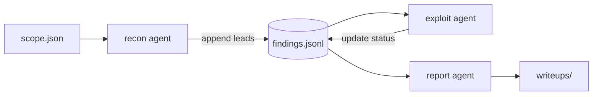

# Multi-agent assessments (vendor-neutral)

The MCP server is driven by **one client per session**. To run a larger
engagement across several agents — or several sessions of the same agent —
coordinate them through **files in a shared working directory**, not through any
host-specific subagent API. Every MCP-capable client can read and write files
and call the same governed tools, so this pattern behaves identically on Claude
Code, Codex, Cursor, Continue, Cline, Goose, and local models behind an MCP
host. See [`AGENTS.md`](../AGENTS.md) for the tool contract and
[`docs/AI_CLIENTS.md`](AI_CLIENTS.md) for per-client setup.

## Why files, not a host task API

- **Universality.** Coordination lives in the filesystem, which every client
  already has. Nothing depends on a proprietary fan-out primitive, so the same
  engagement is portable across clients.
- **Governance stays server-side.** Every agent calls the same server, so every
  action passes the same policy layer (`CYBERSEC_MCP_ALLOW_EXTERNAL`,
  `CYBERSEC_MCP_ALLOW_SCRIPTS`) and lands in the same JSON-line audit log. Adding
  agents does not widen the blast radius; authorization is enforced once, at the
  server, not per client.
- **Crash tolerance.** Append-only state survives a dead session. A replacement
  agent resumes from the files instead of from lost conversation history.

## Shared working directory

Pick one directory per engagement and treat it as the only source of truth:

```text
engagement/
  scope.json        # authorized targets + policy — the contract every agent obeys
  findings.jsonl    # append-only; one JSON object per finding
  state.json        # phase/status per role
  notes/            # freeform per-agent notes
  artifacts/        # captured output and evidence (sanitize before sharing)
```

`scope.json` is written once and read by every agent:

```json
{
  "engagement": "acme-external-2026-08",
  "authorized_targets": ["10.10.0.0/24", "app.internal.example"],
  "allow_external": false,
  "allow_scripts": false,
  "notes": "Companion mode. Autonomous only on explicit written approval."
}
```

Each finding is a single append-only line, so concurrent writers never clobber
each other:

```json
{"id": "F-001", "role": "recon", "target": "app.internal.example", "status": "lead", "summary": "Login form reflects `next` param", "next": "test open redirect / XSS"}
```

## Roles and handoff

Give each agent one role and the same `scope.json`. Handoff happens by writing to
`findings.jsonl` and `state.json`, not by passing messages.

| Role | Reads | Does | Writes |
| --- | --- | --- | --- |
| recon | `scope.json` | `guided_assessment`, `run_tool`, `run_pipeline` | new `lead` findings |
| exploit | `findings.jsonl` (`status = lead`) | validate with `run_tool` / `run_script` | `confirmed` / `dead-end` |
| report | `findings.jsonl` (`status = confirmed`) | synthesize | a writeup under `writeups/` |



## Walkthrough

Two sessions against the same directory, in any two MCP clients:

1. **Recon session.** Start with `guided_assessment` (or `suggest_for_ctf` /
   `suggest_for_bounty`) to classify the target, then execute with
   `run_tool` / `run_pipeline`. Append each anomaly to `findings.jsonl` with
   `status: "lead"`.
2. **Exploit session.** Read `findings.jsonl`, take every `lead`, and validate it
   with `run_tool` (or `run_script` only when programming logic is the smallest
   reliable path). Rewrite each line's status to `confirmed` or `dead-end` and
   record the proof in `artifacts/`.
3. **Report.** Read the `confirmed` findings and write the mandatory technical
   writeup under `writeups/`. Sanitize evidence first — flag credentials by
   existence and access method, never by spreading the secret across outputs.

Because state is on disk, step 2 can start before step 1 finishes: the exploit
agent simply polls `findings.jsonl` for new `lead` rows.

## Governance and safety

- **Companion by default; autonomous only when asked.** Escalate a role to
  `guided_assessment(mode="autonomous")` only with explicit authorization
  recorded in `scope.json`.
- **`scope.json` is the boundary.** Every agent re-reads it and acts only within
  `authorized_targets`. The server's `CYBERSEC_MCP_ALLOW_EXTERNAL=0` default is a
  preflight policy, not a network sandbox — keep the scope honest.
- **One audit trail.** All agents share the server's audit log, so the whole
  engagement is reconstructable from a single place.
- **Reusable helpers** go under `manual_scripts/`; **findings** go under
  `writeups/`. Both are shared across every agent in the run.

## Single-agent fallback

The pattern degrades cleanly to one session: the same directory makes a solo
run resumable after context compaction, since each phase reconstructs its state
from `scope.json`, `findings.jsonl`, and `state.json` rather than from chat
history.

## Host accelerators (optional)

Some hosts add a native fan-out primitive — Claude Code's `Task` subagents, used
by the `zeroize-audit` and `semgrep` skills, is one example. Use it as an
accelerator *on top of* this pattern, but keep coordination in the shared files
so the engagement stays portable to clients that have no such primitive.
